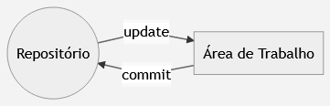
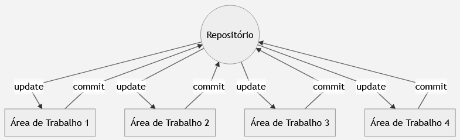
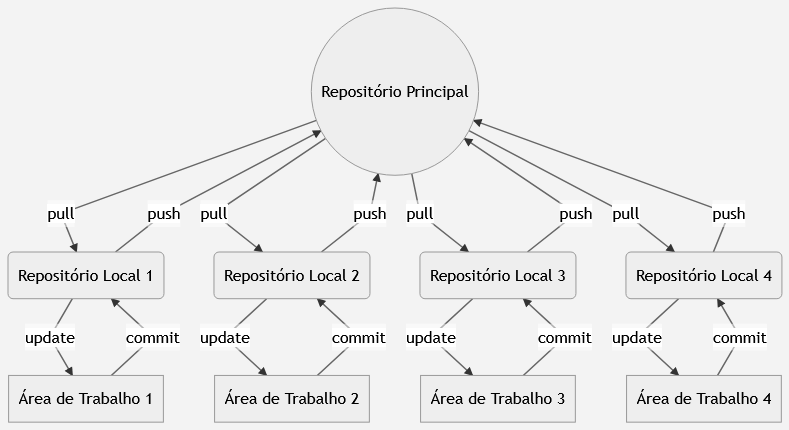

# O que é um *VCS*?

Um *Version Control System* (*VCS*) é um *software* de gerenciamento das alterações feitas em arquivos. Ele possibilita que as alterações feitas possam ser comparadas, restauradas e mescladas.

## Benefícios de um *VCS*

Um *VCS* é uma ferramenta fundamental para o desenvolvimento de *softwares*. Seus principais benefícios são:

 - Registro histórico: Toda a evolução do projeto, cada alteração sobre cada arquivo é guardada. Por conta disso, é possível identificar o autor, o dia e qual alteração foi feita.
 - Colaboração concorrente: Possibilita que vários desenvolvedores trabalhem em paralelo sobre os mesmos arquivos sem que um sobrescreva o código de outro.
 - Variações no Projeto: Mantém linhas diferentes de evolução do mesmo projeto. Por exemplo, mantendo uma versão 1.0 enquanto a equipe prepara uma versão 2.0.

## Funcionamento de um *VCS*

Um *VCS* é composto de duas partes, são elas:

- Repositório: Armazena todo o histórico de evolução do projeto, registrando toda e qualquer alteração feita em cada arquivo .
- Área de trabalho: Armazena uma cópia dos arquivos presentes no repositório. Essas cópias podem ser modificadas pelo programador de acordo com sua vontade —  qualquer alteração feita nos aquisitivos é monitorada, dessa forma é possível identificar todas mudanças feitas.

Na prática, acontece o seguinte:

As alterações feitas na área de trabalho podem ser enviadas para o repositório sempre que o desenvolvedor quiser — essa ação é conhecida como *commit*. Em contra partida, caso o desenvolvedor queira ter acesso aos arquivos contidos no repositório, basta atualizar sua área de trabalho —  ação conhecida como *update*.

### Tipos de *VCS*

Atualmente, os sistemas de controle de versão são classificados em dois tipos, são eles:

 - *Centralized Version Control System*(*CVCS*): Trabalha com um servidor, que funciona como repositório central único, e áreas de trabalho que são utilizadas nas máquinas dos desenvolvedores. As áreas de trabalho se comunicam apenas através do repositório central, por meio de *commit* e *update*. Abaixo segue uma representação de um *CVCS*:
 

 - *Distributed Version Control System*(*DVCS*): Cada área de trabalho tem seu repositórios individuais, ou seja, as operações de *commit* e *update* são feitas nas máquinas dos desenvolvedores. Porém, existe um servidor remoto que funciona como repositório oficial e permite a comunicação entre os repositórios individuais — o envio de arquivos do repositório local para o oficial é chamado de *push*, já o caminho inverso é chamado de *pull*. Abaixo segue uma representação de um *DVCS*:
 
 

Os *CVCS's* atende a maioria das equipes de desenvolvimento. Contudo, caso a quantidade de interações feitas entre as áreas de trabalho e o repositório seja maior que a suportada pelo servidor o mesmo pode ser sobrecarregado e o trabalho da equipe ser prejudicado.

Por outro lado, os *DVCS's* não sofrem desse problema — o uso de repositórios individuais acaba poupando o repositório oficial. Entretanto, é necessário um maior conhecimento da ferramenta por parte do desenvolvedor.